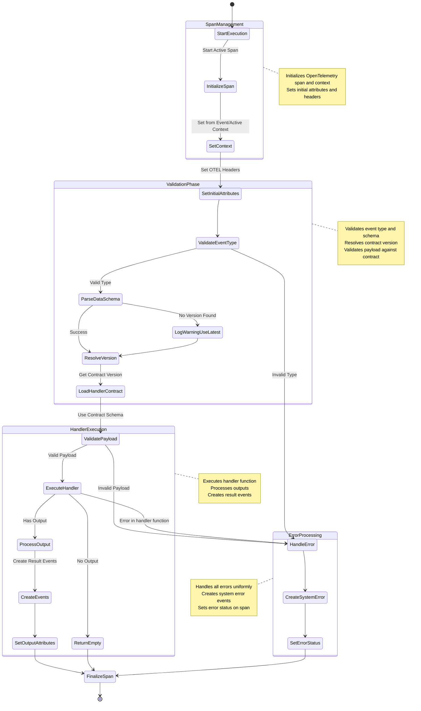
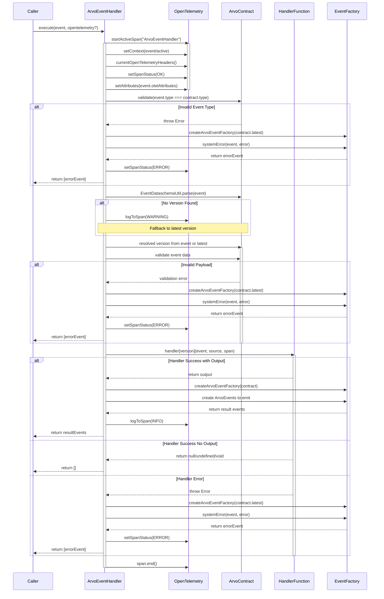

# ArvoEventHandler Technical Documentation

The ArvoEventHandler is a crucial component for handling Arvo events within the system. It manages the lifecycle of event processing, from initial receipt through validation, execution, and response generation, while maintaining comprehensive telemetry through OpenTelemetry integration.

## Core Responsibilities

The handler manages several key aspects of event processing:

1. Telemetry and tracing through OpenTelemetry
2. Event validation against contracts
3. Version resolution and compatibility
4. Error handling and system error event generation
5. Result event creation and routing

## Execution flow

## Component diagram

The sequence diagram below illustrates the interactions between different components during event processing:

## Detailed Phase Descriptions

The execution process consists of four main phases:

### Span Management Phase

- Initializes OpenTelemetry context for distributed tracing
- Sets up span attributes for observability
- Ensures proper context propagation for distributed systems

### Validation Phase

- Verifies event type matches the contract
- Parses event data schema for version information
- Handles version resolution with fallback mechanisms
- Validates event payload against contract schema

### Handler Execution Phase

- Executes the appropriate version-specific handler
- Processes handler output
- Creates result events with proper routing
- Maintains telemetry throughout execution

### Error Processing Phase

- Provides uniform error handling across all phases
- Creates properly formatted system error events
- Ensures proper error reporting in telemetry

## Error Handling Strategy

The handler implements a comprehensive error handling strategy that:

- Catches and processes all errors uniformly
- Creates system error events with appropriate routing
- Maintains telemetry context through error scenarios
- Provides detailed error information for debugging

## Telemetry Integration

OpenTelemetry integration provides:

- Distributed tracing across the event processing lifecycle
- Detailed span attributes for debugging and monitoring
- Proper context propagation for distributed systems
- Performance metrics for each processing phase
