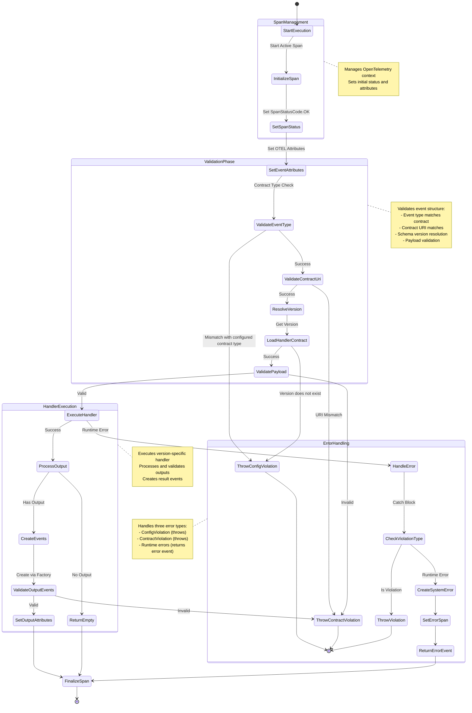
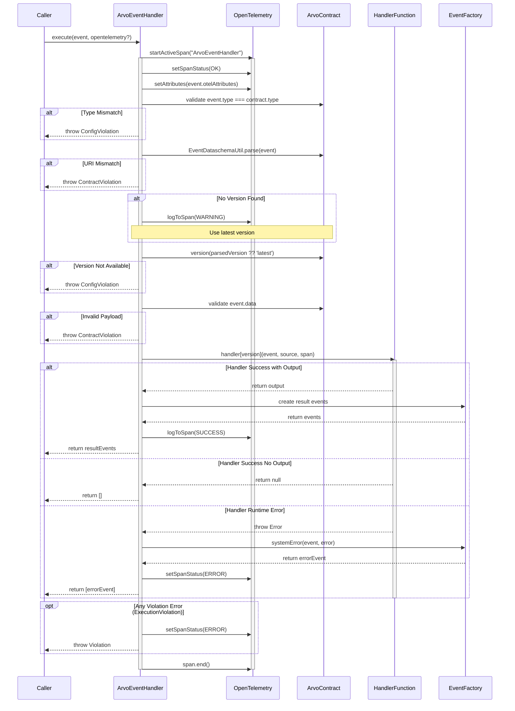

# ArvoEventHandler Technical Documentation

The ArvoEventHandler is a crucial component for handling Arvo events within the system. It manages the lifecycle of event processing, from initial receipt through validation, execution, and response generation, while maintaining comprehensive telemetry through OpenTelemetry integration.

## Core Responsibilities

The handler manages several key aspects of event processing:

1. Telemetry and tracing through OpenTelemetry
2. Event validation against contracts
3. Version resolution and compatibility
4. Error handling and system error event generation
5. Result event creation and routing

## Execution flow

## Component diagram

The sequence diagram below illustrates the interactions between different components during event processing:

