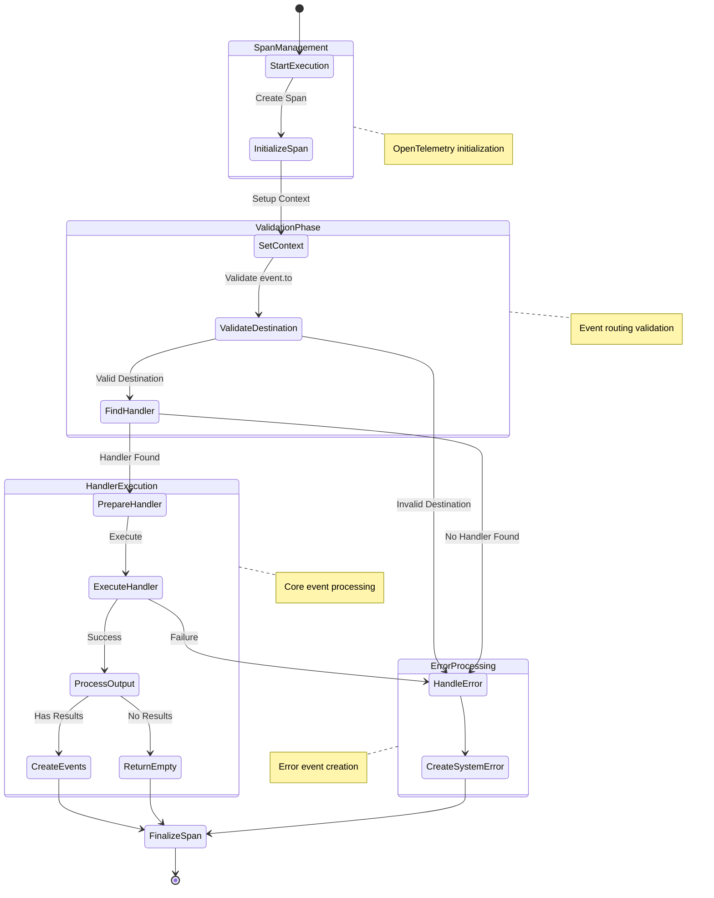
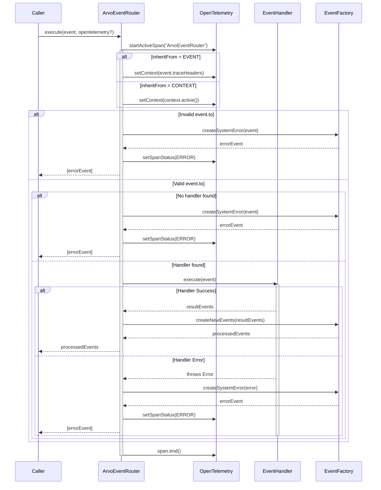

# ArvoEventRouter

The ArvoEventRouter class provides a robust event routing mechanism for ArvoEvents, directing incoming events to their appropriate handlers while maintaining comprehensive telemetry through OpenTelemetry integration.

## Key Features

- Event routing based on type matching
- Automatic span and telemetry management
- Comprehensive error handling and propagation
- Support for execution cost tracking
- Handler validation and lifecycle management

## Core Execution Flow

The router's execution process consists of four main phases:

1. **Span Management**

   - Creates and configures OpenTelemetry spans
   - Establishes tracing context from events or execution environment

2. **Validation Phase**

   - Validates event destination against router source
   - Locates appropriate handler for event type

3. **Handler Execution**

   - Processes events through matched handlers
   - Manages event results and transformations

4. **Error Processing**
   - Creates system error events for failures
   - Maintains error context and telemetry

## Usage Example

```typescript
const router = createArvoEventRouter({
  source: 'order.service',
  executionunits: 1,
  handlers: [orderCreatedHandler, orderUpdatedHandler],
});

const event = createArvoEvent({
  type: 'order.created',
  to: 'order.service',
  // ... other event properties
});

const results = await router.execute(event);
```

## Error Handling

The router provides comprehensive error handling for various failure scenarios:

- Invalid event destination
- Missing handlers
- Handler execution failures
- System errors

All errors are transformed into system error events and propagated with appropriate telemetry context.

## Telemetry Integration

OpenTelemetry integration provides detailed execution tracking:

- Span creation and management
- Error tracking and status updates
- Event attribute propagation
- Execution context maintenance

## Implementation Details

See the execution flow and sequence diagrams above for detailed visualization of the router's operation. These diagrams illustrate the complete lifecycle of event processing from initial span creation through to final event delivery or error handling.

For more details on specific components or integration patterns, refer to the related documentation sections:

- ArvoEventHandler
- OpenTelemetry Integration Guide
- Event Contract Specifications

## Execution flow diagram



## Execution sequence diagram


