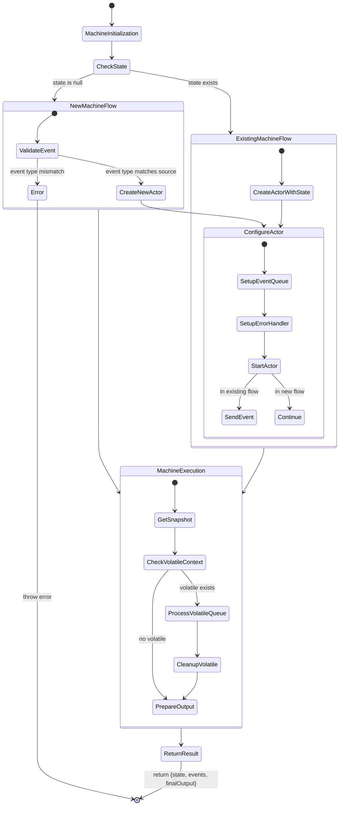

# `MachineExecutionEngine` Execution Flows

## Overview

This document outlines the execution flows within the MachineExecutionEngine's `.execute` method, providing both state and sequence perspectives of the system's behavior. The documentation aims to give developers a clear understanding of how the engine processes both new and existing machine states.

## State Flow Diagram

The state diagram below illustrates the complete execution path of the `.execute` function. It demonstrates how the engine handles different scenarios and processes states through various phases of execution.

### Key Processing Phases

The execution flow progresses through several distinct phases:

1. **Initialization Phase**: The process begins with machine initialization, where the engine prepares for execution by validating inputs and setting up necessary resources.

2. **State Evaluation**: The engine determines whether it's dealing with a new machine instance or resuming an existing one, branching into appropriate handling paths.

3. **Configuration Phase**: Regardless of the path taken, both flows converge at the actor configuration stage, where the system sets up event queues and error handlers.

4. **Execution Phase**: The final phase involves processing the machine state, handling any volatile contexts, and preparing the output.

## Sequence Diagram

The sequence diagram provides a temporal view of the system's operation, showing how different components interact throughout the execution process. This representation is particularly valuable for understanding the timing and dependencies between system components.

### Component Interactions

The system comprises four main components that interact during execution:

- **Client**: Initiates the execution process
- **ExecuteMachine**: Manages the overall execution flow
- **Actor**: Handles the state machine's actual state transitions
- **Logger**: Provides execution tracking and debugging capabilities

```mermaid
sequenceDiagram
    participant Client
    participant MachineExecutionEngine
    participant ArvoOpenTelemetry
    participant Span
    participant XStateActor
    participant MachineLo as Machine Logic<br/>(XState)
    participant EventQueue
    participant ErrorSubscriber

    Client->>MachineExecutionEngine: execute({machine, state, event}, opentelemetry?)
    
    Note over MachineExecutionEngine: Prepare OTel Configuration
    MachineExecutionEngine->>MachineExecutionEngine: Determine OTel context inheritance
    
    alt opentelemetry.inheritFrom === 'EVENT'
        MachineExecutionEngine->>MachineExecutionEngine: Extract trace headers from event
        Note over MachineExecutionEngine: context = {<br/>  inheritFrom: 'TRACE_HEADERS',<br/>  traceHeaders: {<br/>    traceparent: event.traceparent,<br/>    tracestate: event.tracestate<br/>  }<br/>}
    else opentelemetry.inheritFrom === 'CONTEXT'
        MachineExecutionEngine->>MachineExecutionEngine: Use active context
        Note over MachineExecutionEngine: context = {<br/>  inheritFrom: 'CONTEXT',<br/>  context: context.active()<br/>}
    end
    
    MachineExecutionEngine->>ArvoOpenTelemetry: getInstance().startActiveSpan({name, spanOptions, context, fn})
    Note over ArvoOpenTelemetry: Span configuration:<br/>- name: 'Execute Machine'<br/>- kind: INTERNAL<br/>- attributes: machine.type, machine.version, event attributes
    
    ArvoOpenTelemetry->>Span: create span
    Span-->>MachineExecutionEngine: span
    
    rect rgb(220, 240, 220)
        Note over MachineExecutionEngine: Initialization Phase
        
        MachineExecutionEngine->>MachineExecutionEngine: eventQueue = []
        MachineExecutionEngine->>MachineExecutionEngine: errors = []
        
        alt state === null (New Orchestration)
            MachineExecutionEngine->>Span: logToSpan(INFO, 'Starting new orchestration...')
            
            alt event.type ≠ machine.source
                MachineExecutionEngine-->>MachineExecutionEngine: throw Error('Invalid initialization event...')
                Note over MachineExecutionEngine: Error message:<br/>"Machine requires source event<br/>'${machine.source}' to start,<br/>but received '${event.type}'"
                MachineExecutionEngine->>Span: Record exception
                MachineExecutionEngine->>Span: end()
                MachineExecutionEngine-->>Client: throw Error
            end
            
            Note over MachineExecutionEngine,XStateActor: Create New Actor
            MachineExecutionEngine->>XStateActor: createActor(machine.logic, {input: event.toJSON()})
            XStateActor-->>MachineExecutionEngine: actor
            
        else state exists (Resume Orchestration)
            MachineExecutionEngine->>Span: logToSpan(INFO, 'Resuming orchestration from existing state...')
            
            Note over MachineExecutionEngine,XStateActor: Create Actor from Snapshot
            MachineExecutionEngine->>XStateActor: createActor(machine.logic, {snapshot: state})
            XStateActor-->>MachineExecutionEngine: actor
        end
    end
    
    rect rgb(240, 220, 200)
        Note over MachineExecutionEngine,EventQueue: Event & Error Listener Setup
        
        MachineExecutionEngine->>XStateActor: actor.on('*', eventHandler)
        Note over XStateActor: Event handler:<br/>(event) => eventQueue.push(event)
        XStateActor-->>MachineExecutionEngine: listener registered
        
        MachineExecutionEngine->>XStateActor: actor.subscribe({error: errorHandler})
        Note over XStateActor: Error handler:<br/>(err) => errors.push(err)
        XStateActor-->>MachineExecutionEngine: subscriber registered
    end
    
    rect rgb(200, 220, 240)
        Note over MachineExecutionEngine,MachineLo: Machine Execution Phase
        
        alt New Orchestration (state === null)
            MachineExecutionEngine->>XStateActor: actor.start()
            XStateActor->>MachineLo: Initialize with input event
            
            Note over MachineLo: Machine processes initial event<br/>Executes entry actions<br/>Transitions to initial state
            
            loop Machine emits events
                MachineLo->>XStateActor: Emit event via enqueueArvoEvent action
                XStateActor->>EventQueue: Trigger '*' listener
                EventQueue->>EventQueue: eventQueue.push(event)
            end
            
            alt Machine encounters error
                MachineLo->>XStateActor: Throw error
                XStateActor->>ErrorSubscriber: Trigger error subscriber
                ErrorSubscriber->>ErrorSubscriber: errors.push(err)
            end
            
            MachineLo-->>XStateActor: Machine reaches stable state
            
        else Resume Orchestration (state exists)
            MachineExecutionEngine->>XStateActor: actor.start()
            XStateActor->>MachineLo: Restore from snapshot
            
            Note over MachineLo: Machine restores:<br/>- Previous state<br/>- Context<br/>- Event history
            
            MachineLo-->>XStateActor: Machine restored
            
            MachineExecutionEngine->>XStateActor: actor.send(event.toJSON())
            XStateActor->>MachineLo: Process incoming event
            
            Note over MachineLo: Machine processes event<br/>Executes transitions<br/>Updates context<br/>Emits events
            
            loop Machine emits events
                MachineLo->>XStateActor: Emit event via enqueueArvoEvent action
                XStateActor->>EventQueue: Trigger '*' listener
                EventQueue->>EventQueue: eventQueue.push(event)
            end
            
            alt Machine encounters error
                MachineLo->>XStateActor: Throw error
                XStateActor->>ErrorSubscriber: Trigger error subscriber
                ErrorSubscriber->>ErrorSubscriber: errors.push(err)
            end
            
            MachineLo-->>XStateActor: Machine reaches stable state
        end
        
        MachineExecutionEngine->>Span: logToSpan(INFO, 'Machine execution completed successfully...')
        Note over Span: Logs event queue length
    end
    
    rect rgb(240, 240, 200)
        Note over MachineExecutionEngine: Snapshot Extraction Phase
        
        MachineExecutionEngine->>Span: logToSpan(INFO, 'Extracting final state snapshot...')
        
        MachineExecutionEngine->>XStateActor: actor.getPersistedSnapshot()
        XStateActor-->>MachineExecutionEngine: extractedSnapshot
        
        Note over MachineExecutionEngine: extractedSnapshot structure:<br/>- status: 'active' | 'done' | 'error' | 'stopped'<br/>- value: current state value<br/>- context: machine context<br/>- output: final output (if terminal)<br/>- error: error object (if error state)
    end
    
    rect rgb(220, 220, 240)
        Note over MachineExecutionEngine: Volatile Context Processing
        
        alt extractedSnapshot has volatile context
            Note over MachineExecutionEngine: Check for:<br/>extractedSnapshot.context.arvo$$.volatile$$
            
            alt volatile$$.eventQueue$$ exists
                MachineExecutionEngine->>MachineExecutionEngine: Extract volatile event queue
                
                loop For each event in volatile$$.eventQueue$$
                    MachineExecutionEngine->>EventQueue: eventQueue.push(volatileEvent)
                end
                
                Note over MachineExecutionEngine: Volatile events merged into main queue
            end
            
            MachineExecutionEngine->>MachineExecutionEngine: Clear volatile context
            Note over MachineExecutionEngine: extractedSnapshot.context.arvo$$.volatile$$ = undefined
        end
    end
    
    rect rgb(200, 240, 240)
        Note over MachineExecutionEngine: Error Handling Phase
        
        alt errors.length > 0
            MachineExecutionEngine->>Span: Record error
            MachineExecutionEngine->>Span: end()
            MachineExecutionEngine-->>Client: throw errors[0]
        end
    end
    
    rect rgb(240, 200, 240)
        Note over MachineExecutionEngine: Output Resolution Phase
        
        MachineExecutionEngine->>MachineExecutionEngine: finalOutput = extractedSnapshot?.output ?? null
        MachineExecutionEngine->>MachineExecutionEngine: existingOutput = state?.output ?? null
        
        alt JSON.stringify(finalOutput) === JSON.stringify(existingOutput)
            MachineExecutionEngine->>MachineExecutionEngine: finalOutput = null
            Note over MachineExecutionEngine: Output unchanged from previous state<br/>Set to null to avoid duplicate emissions
        end
    end
    
    rect rgb(200, 240, 200)
        Note over MachineExecutionEngine: Success Response Phase
        
        MachineExecutionEngine->>Span: end()
        
        MachineExecutionEngine-->>Client: return {<br/>  state: extractedSnapshot,<br/>  events: eventQueue,<br/>  finalOutput: finalOutput<br/>}
        
        Note over Client: Return value:<br/>- state: Persisted XState snapshot<br/>- events: All emitted events<br/>- finalOutput: Machine output or null
    end
```

## Error Handling

The execution engine implements comprehensive error handling throughout the process. Error scenarios are logged and propagated appropriately, ensuring system stability and providing meaningful feedback for debugging purposes.

## State Persistence

The engine maintains state consistency through careful management of the snapshot mechanism. Each execution cycle produces a new snapshot that captures the complete state of the machine, including any volatile contexts that need to be processed.

## Best Practices

When working with the execution engine, consider these key points:

1. Always validate input events before processing to ensure type compatibility.
2. Monitor execution logs for unexpected state transitions or error conditions.
3. Handle volatile contexts appropriately to prevent resource leaks.
4. Implement proper error handling in client code to handle potential execution failures.

## Further Reading

For more detailed information about implementing custom execution flows or extending the existing functionality, please refer to the following resources:

- XState Documentation: [https://stately.ai/docs/quick-start](https://stately.ai/docs/quick-start)
