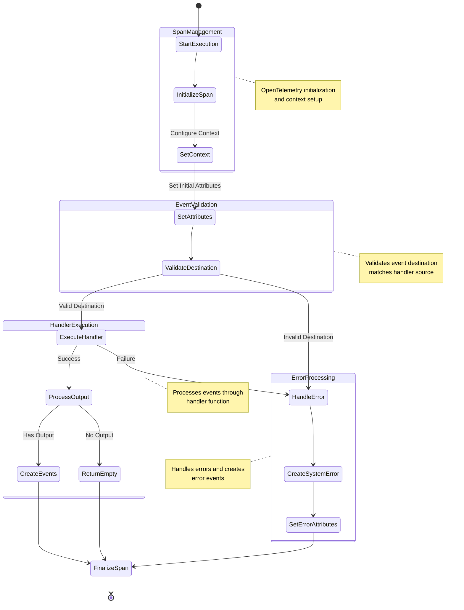
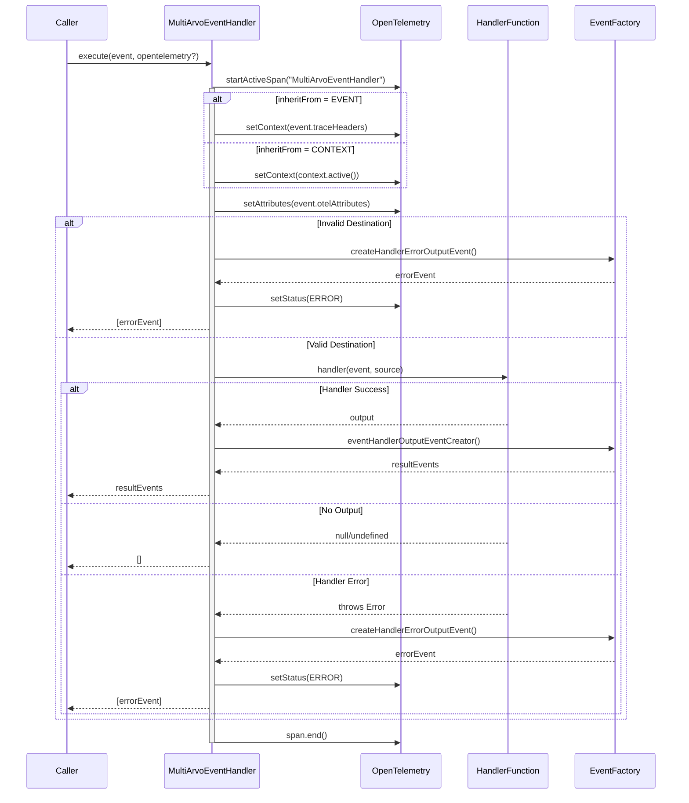

# MultiArvoEventHandler.execute

Below are the execution flow diagrams of the execute function for the handler

## Execution flow diagram

```mermaid
stateDiagram-v2
    [*] --> StartExecution

    state SpanManagement {
        StartExecution --> InitializeSpan
        InitializeSpan --> SetContext: Configure Context
        SetContext --> SetAttributes: Set Initial Attributes
    }

    state EventValidation {
        SetAttributes --> ValidateDestination
        ValidateDestination --> ExecuteHandler: Valid Destination
        ValidateDestination --> HandleError: Invalid Destination
    }

    state HandlerExecution {
        ExecuteHandler --> ProcessOutput: Success
        ExecuteHandler --> HandleError: Failure

        ProcessOutput --> CreateEvents: Has Output
        ProcessOutput --> ReturnEmpty: No Output
    }

    state ErrorProcessing {
        HandleError --> CreateSystemError
        CreateSystemError --> SetErrorAttributes
    }

    CreateEvents --> FinalizeSpan
    ReturnEmpty --> FinalizeSpan
    SetErrorAttributes --> FinalizeSpan
    FinalizeSpan --> [*]

    note right of SpanManagement
        OpenTelemetry initialization
        and context setup
    end note

    note right of EventValidation
        Validates event destination
        matches handler source
    end note

    note right of HandlerExecution
        Processes events through
        handler function
    end note

    note right of ErrorProcessing
        Handles errors and creates
        error events
    end note
```

## Execution sequence diagram

```mermaid
sequenceDiagram
    participant Caller
    participant Handler as MultiArvoEventHandler
    participant OTel as OpenTelemetry
    participant Function as HandlerFunction
    participant Factory as EventFactory

    Caller->>Handler: execute(event, opentelemetry?)

    %% Span Management
    Handler->>OTel: startActiveSpan("MultiArvoEventHandler")
    activate Handler

    alt inheritFrom = EVENT
        Handler->>OTel: setContext(event.traceHeaders)
    else inheritFrom = CONTEXT
        Handler->>OTel: setContext(context.active())
    end

    Handler->>OTel: setAttributes(event.otelAttributes)

    %% Event Validation
    alt Invalid Destination
        Handler->>Factory: createHandlerErrorOutputEvent()
        Factory-->>Handler: errorEvent
        Handler->>OTel: setStatus(ERROR)
        Handler-->>Caller: [errorEvent]
    else Valid Destination
        Handler->>Function: handler(event, source)

        alt Handler Success
            Function-->>Handler: output
            Handler->>Factory: eventHandlerOutputEventCreator()
            Factory-->>Handler: resultEvents
            Handler-->>Caller: resultEvents
        else No Output
            Function-->>Handler: null/undefined
            Handler-->>Caller: []
        else Handler Error
            Function-->>Handler: throws Error
            Handler->>Factory: createHandlerErrorOutputEvent()
            Factory-->>Handler: errorEvent
            Handler->>OTel: setStatus(ERROR)
            Handler-->>Caller: [errorEvent]
        end
    end

    Handler->>OTel: span.end()
    deactivate Handler
```
