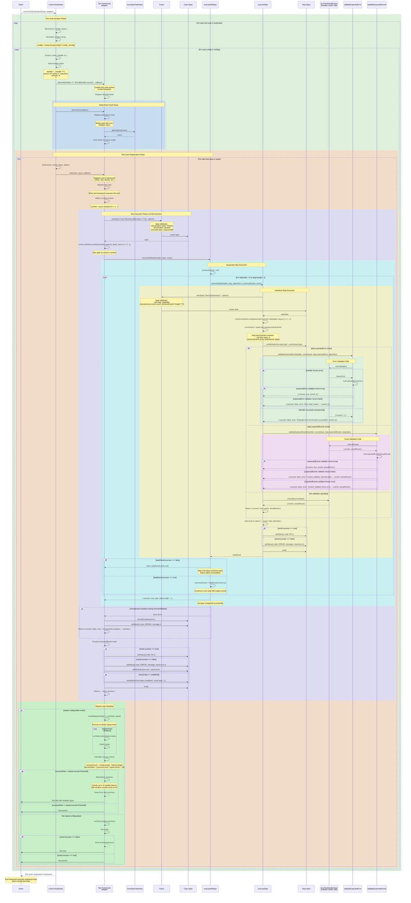

Following is the execution diagram for `runArvoTestSuites`

```mermaid
sequenceDiagram
    participant Client
    participant runArvoTestSuites
    participant TestAdapter as Test Framework<br/>Adapter
    participant ArvoOpenTelemetry
    participant Tracer
    participant CaseSpan as Case Span
    participant executeAllSteps
    participant executeStep
    participant StepSpan as Step Span
    participant Handler as ArvoTestHandlerType<br/>(Handler Under Test)
    participant validateExpectedError
    participant validateExpectedEvents

    Client->>runArvoTestSuites: runArvoTestSuites(testSuites, adapter)
    
    rect rgb(220, 240, 220)
        Note over runArvoTestSuites: Test Suite Iteration Phase
        
        loop For each test suite in testSuites
            runArvoTestSuites->>runArvoTestSuites: Destructure { config, cases }
            
            runArvoTestSuites->>runArvoTestSuites: Normalize config to array
            Note over runArvoTestSuites: configs = Array.isArray(config) ? config : [config]
            
            loop For each config in configs
                runArvoTestSuites->>runArvoTestSuites: Extract { name, handler, fn }
                
                runArvoTestSuites->>runArvoTestSuites: Build handler object
                Note over runArvoTestSuites: handler = _handler ?? {<br/>  source: fn?.name ?? 'unknown',<br/>  execute: fn<br/>}
                
                runArvoTestSuites->>TestAdapter: describe(fnName ?? `Test<${handler.source}>`, callback)
                Note over TestAdapter: Creates test suite context<br/>in test framework
                
                TestAdapter->>TestAdapter: Register describe block
                
                rect rgb(200, 220, 240)
                    Note over runArvoTestSuites,Tracer: BeforeEach Hook Setup
                    
                    runArvoTestSuites->>TestAdapter: beforeEach(callback)
                    TestAdapter->>TestAdapter: Register beforeEach hook
                    
                    Note over TestAdapter: Before each test runs:<br/>Initialize tracer
                    TestAdapter->>ArvoOpenTelemetry: getInstance().tracer
                    ArvoOpenTelemetry-->>TestAdapter: tracer
                    TestAdapter->>TestAdapter: Store tracer in closure scope
                end
                
                rect rgb(240, 220, 200)
                    Note over runArvoTestSuites,executeAllSteps: Test Case Registration Phase
                    
                    loop For each test case in cases
                        runArvoTestSuites->>runArvoTestSuites: Destructure { name, steps, repeat }
                        
                        runArvoTestSuites->>TestAdapter: test(name, async callback)
                        Note over TestAdapter: Registers test in framework<br/>(Vitest, Jest, Mocha, etc.)
                        
                        TestAdapter->>TestAdapter: Register test case
                        
                        Note over TestAdapter: When test framework executes this test:
                        
                        TestAdapter->>TestAdapter: Define runTest function
                        Note over TestAdapter: runTest = async (iteration?) => {...}
                        
                        rect rgb(220, 220, 240)
                            Note over TestAdapter,CaseSpan: Test Execution Phase (runTest function)
                            
                            TestAdapter->>Tracer: startSpan(`Case<${name}>[${iteration ?? 0}]`, options)
                            Note over Tracer: Span attributes:<br/>- test.function.name: fnName<br/>- test.iteration: iteration<br/>- test.total.steps: steps.length
                            Tracer->>CaseSpan: create span
                            CaseSpan-->>TestAdapter: span
                            
                            TestAdapter->>TestAdapter: context.with(trace.setSpan(context.active(), span), async () => {...})
                            Note over TestAdapter: Sets span as active in context
                            
                            TestAdapter->>executeAllSteps: executeAllSteps(handler, steps, tracer)
                            
                            rect rgb(200, 240, 240)
                                Note over executeAllSteps,executeStep: Sequential Step Execution
                                
                                executeAllSteps->>executeAllSteps: previousEvents = null
                                
                                loop For stepIndex = 0 to steps.length - 1
                                    executeAllSteps->>executeStep: executeStep(handler, step, stepIndex+1, previousEvents, tracer)
                                    
                                    rect rgb(240, 240, 200)
                                        Note over executeStep,StepSpan: Individual Step Execution
                                        
                                        executeStep->>Tracer: startSpan(`Step<${stepIndex}>`, options)
                                        Note over Tracer: Span attributes:<br/>- test.step: stepIndex<br/>- test.previous.events.count: previousEvents?.length ?? 0
                                        Tracer->>StepSpan: create span
                                        StepSpan-->>executeStep: stepSpan
                                        
                                        executeStep->>executeStep: context.with(trace.setSpan(context.active(), stepSpan), async () => {...})
                                        
                                        executeStep->>executeStep: currentInput = await step.input(previousEvents)
                                        Note over executeStep: Step input function receives:<br/>- null (first step), or<br/>- previousEvents array (subsequent steps)
                                        
                                        executeStep->>StepSpan: setAttribute('test.input.type', currentInput.type)
                                        
                                        alt step.expectedError exists
                                            executeStep->>validateExpectedError: validateExpectedError(handler, currentInput, step.expectedError, stepIndex)
                                            
                                            rect rgb(220, 240, 220)
                                                Note over validateExpectedError,Handler: Error Validation Path
                                                
                                                validateExpectedError->>Handler: execute(input)
                                                
                                                alt Handler throws error
                                                    Handler-->>validateExpectedError: throw Error
                                                    validateExpectedError->>validateExpectedError: Call expectedError(error)
                                                    
                                                    alt expectedError validator returns true
                                                        validateExpectedError-->>executeStep: { success: true, events: [] }
                                                    else expectedError validator returns false
                                                        validateExpectedError-->>executeStep: { success: false, error: "Error didn't match...", events: [] }
                                                    end
                                                else Handler succeeds (unexpected)
                                                    Handler-->>validateExpectedError: { events: [...] }
                                                    validateExpectedError-->>executeStep: { success: false, error: "Expected error but function succeeded", events: [] }
                                                end
                                            end
                                            
                                        else step.expectedEvents exists
                                            executeStep->>validateExpectedEvents: validateExpectedEvents(handler, currentInput, step.expectedEvents, stepIndex)
                                            
                                            rect rgb(240, 220, 240)
                                                Note over validateExpectedEvents,Handler: Event Validation Path
                                                
                                                validateExpectedEvents->>Handler: execute(input)
                                                Handler-->>validateExpectedEvents: { events: actualResult }
                                                
                                                validateExpectedEvents->>validateExpectedEvents: Call expectedEvents(actualResult)
                                                
                                                alt expectedEvents validator returns true
                                                    validateExpectedEvents-->>executeStep: { success: true, events: actualResult }
                                                else expectedEvents validator returns false
                                                    validateExpectedEvents-->>executeStep: { success: false, error: "Custom validator returned false...", events: actualResult }
                                                else expectedEvents validator throws error
                                                    validateExpectedEvents-->>executeStep: { success: false, error: "Custom validator threw error...", events: actualResult }
                                                end
                                            end
                                            
                                        else No validation specified
                                            executeStep->>Handler: execute(currentInput)
                                            Handler-->>executeStep: { events: actualResult }
                                            executeStep->>executeStep: Return { success: true, events: actualResult }
                                        end
                                        
                                        executeStep->>executeStep: Add result to object: { ...result, step: stepIndex }
                                        
                                        alt result.success === true
                                            executeStep->>StepSpan: setStatus({ code: OK })
                                        else result.success === false
                                            executeStep->>StepSpan: setStatus({ code: ERROR, message: result.error })
                                        end
                                        
                                        executeStep->>StepSpan: end()
                                        executeStep-->>executeAllSteps: stepResult
                                    end
                                    
                                    alt stepResult.success === false
                                        executeAllSteps-->>TestAdapter: return stepResult (early exit)
                                        Note over executeAllSteps: Stop executing remaining steps<br/>Return failure immediately
                                    else stepResult.success === true
                                        executeAllSteps->>executeAllSteps: previousEvents = stepResult.events || []
                                        Note over executeAllSteps: Continue to next step with output events
                                    end
                                end
                                
                                executeAllSteps-->>TestAdapter: { success: true, step: steps.length - 1 }
                                Note over executeAllSteps: All steps completed successfully
                            end
                            
                            alt Unexpected exception during executeAllSteps
                                executeAllSteps-->>TestAdapter: throw Error
                                TestAdapter->>CaseSpan: recordException(error)
                                TestAdapter->>CaseSpan: setStatus({ code: ERROR, message })
                                TestAdapter->>TestAdapter: Return { success: false, error: "Unexpected exception...", iteration }
                            end
                            
                            TestAdapter->>TestAdapter: Process executeAllSteps result
                            
                            alt result.success === true
                                TestAdapter->>CaseSpan: setStatus({ code: OK })
                            else result.success === false
                                TestAdapter->>CaseSpan: setStatus({ code: ERROR, message: result.error })
                                TestAdapter->>CaseSpan: setAttribute('test.error', result.error)
                            end
                            
                            alt result.step !== undefined
                                TestAdapter->>CaseSpan: setAttribute('test.steps.completed', result.step + 1)
                            end
                            
                            TestAdapter->>CaseSpan: end()
                            TestAdapter->>TestAdapter: Return { ...result, iteration }
                        end
                        
                        rect rgb(200, 240, 200)
                            Note over TestAdapter: Repeat Logic Handling
                            
                            alt repeat configuration exists
                                TestAdapter->>TestAdapter: handleRepeatTest(() => runTest(), repeat)
                                
                                Note over TestAdapter: Execute runTest() repeat.times
                                loop repeat.times iterations
                                    TestAdapter->>TestAdapter: runTest() (with iteration index)
                                    TestAdapter->>TestAdapter: Collect result
                                end
                                
                                TestAdapter->>TestAdapter: Calculate success metrics
                                Note over TestAdapter: successCount = results.length - failures.length<br/>successRate = (successCount / repeat.times) * 100
                                
                                alt successRate < repeat.successThreshold
                                    TestAdapter->>TestAdapter: Build failure summary
                                    Note over TestAdapter: Include up to 10 sample failures<br/>with iteration numbers and errors
                                    TestAdapter-->>TestAdapter: throw Error with summary
                                    TestAdapter->>Client: Test fails with detailed report
                                else successRate >= repeat.successThreshold
                                    TestAdapter->>Client: Test passes
                                end
                                
                            else No repeat configuration
                                TestAdapter->>TestAdapter: runTest() (single execution)
                                TestAdapter->>TestAdapter: Get result
                                
                                alt result.success === false
                                    TestAdapter-->>TestAdapter: throw Error(result.error)
                                    TestAdapter->>Client: Test fails
                                else result.success === true
                                    TestAdapter->>Client: Test passes
                                end
                            end
                        end
                    end
                end
            end
        end
    end
    
    runArvoTestSuites-->>Client: Test suites registered in framework
    Note over Client: Test framework executes registered tests<br/>when running test suite
```